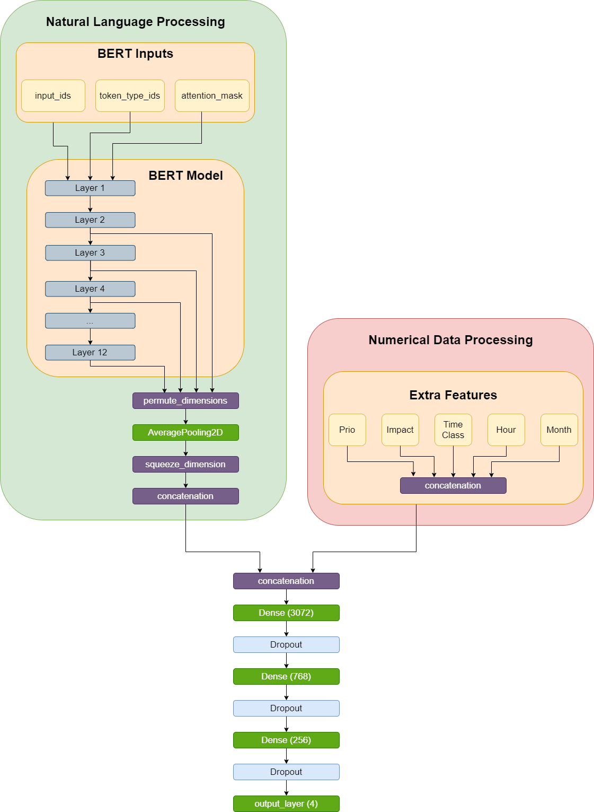

# Neural-networks-applied-to-business-service-improvement
BSc Project.

The code corresponds to part of the project, specifically to the classification model used in section 3.4 Wrong Impact Assigment in a further development phase.

Current Accuracy: 68.8%

## Context
The project is carried out at SEAT, an automotive company part of Volkswagen Group, which
apart from manufacturing personal vehicles, designs and develops mobility products and services
at SEAT:CODE and is currently introducing e-mobility solutions to Barcelona at SEAT:MO.
More precisely, this Artificial Intelligence solution takes place working as a Data
Scientist at SEAT’s IT Department.

## Scope
The scope of this model is to detect a problem or group of problems that will have an impact
actually higher than the indicated when it was created. In order to achieve this, the idea is to
mix both supervised and unsupervised learning as mentioned previously. Impact is the parameter that indicates in a range 1 to 4 how many users are affected by the same problem, then
it makes sense to create a simple multi-class classification model to predict in which category
a problem would fall.

  

** FOR MORE INFO READ MEMORY
